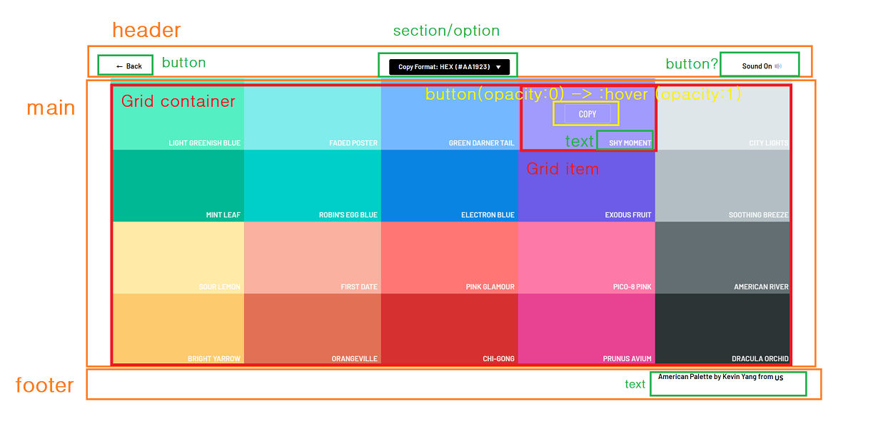
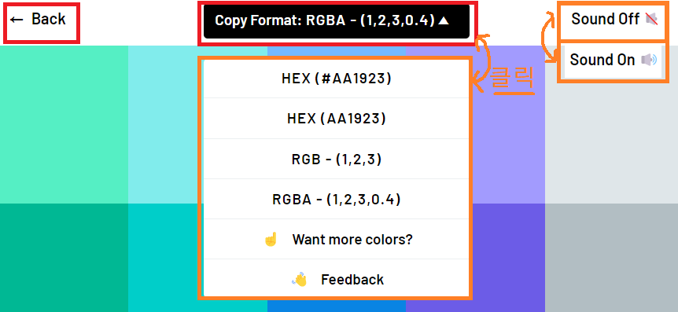
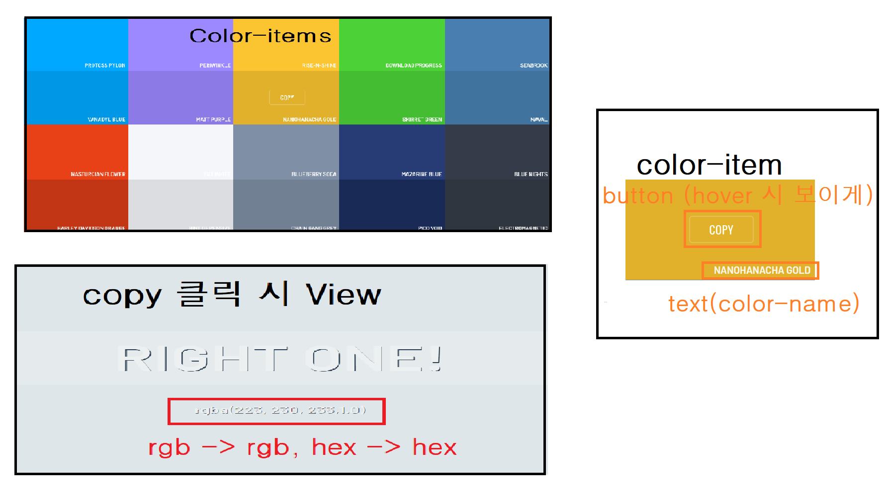
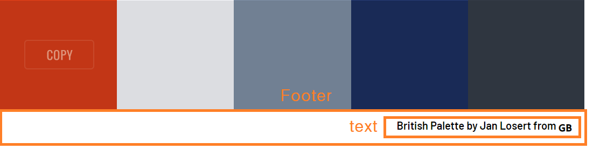

# Color Palette 클론

> 노마드 코더 - 사이드 프로젝트: 1주차 과제 ( 22.09.19 ~ 22.09.25)
>
> 목표:  [Color Palette](https://flatuicolors.com/palette/gb) 클론 

 

## ● View

  

# 구현

## ● Header

- [x] 뒤로가기 버튼 

- [x] (RGB-HEX) convert-메뉴

- [x] Sound on/off 버튼

 

## ● Main

- [x] Color-items - view 구현, Color-items Data: 이중 배열 구현

- [x] Color-item -  Color item bg/name 적용

- [] 클릭 시 view - 구현 X

 

## ● Footer

- [x] slide_text

